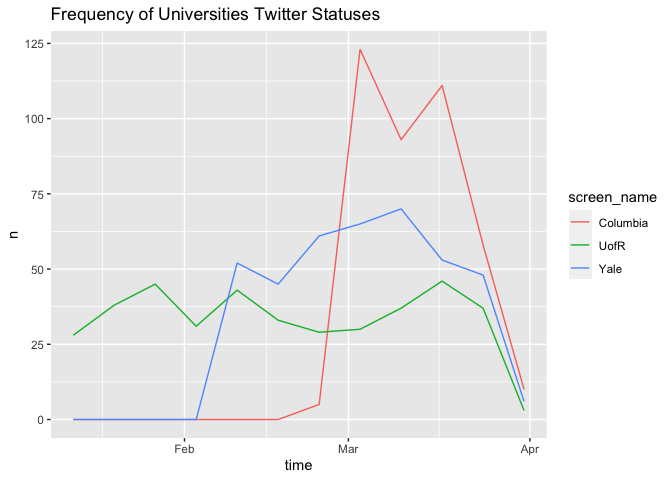

# Twitter API guide in R

Jiayi Yuan

## Setup

These are the libraries needed for this chapter.

``` r
###CRAN installation
library(twitteR)

###This is a GitHub installation
#install.packages(c("devtools", "rjson", "bit64", "httr")) 
library(devtools)
```

    ## Loading required package: usethis

``` r
#install_github("geoffjentry/twitteR")

###CRAN installation
library(rtweet)
```

    ## 
    ## Attaching package: 'rtweet'

    ## The following object is masked from 'package:twitteR':
    ## 
    ##     lookup_statuses

### Setup Twitter Developer Account and APP

(1). Create a Twitter account if you don’t have one, and associate your
phone number to the Twitter account.

(2). Apply for a Twitter Developer Account
(<https://developer.twitter.com/en>) with your personal Twitter account.
Fill out all the information needed and follow the guidance, there
shouldn’t be a problem.

(3). Create a Twitter API App. This step provide you with the important
credentials that will be used in the setup of following connections
between R and the interface. You will need to provide an App name and
write an Application description. These two sections are easy to fill
out, just like creating a file on your computer, but some of the
following sections maybe unfamiliar. For the Website URL, you can put
the link of your personal Twitter account and this is the most
recommended URL link. Make sure both the OAuth 2.0 and OAuth 1.0a are
allowed in the authentication settings, or there might problems in the
setup of R. You will also need to provide a Callback URL.
<http://127.0.0.1:1410>, this link can be used as the Callback URL and
it should be exactly the same link. The Callback URL makes sure you can
link your R studio to your App. Then you can successfully create a
Twitter API App. Once you created, you can get the keys and tokens for
this App. They are important and private, make sure to copy them and do
not share them to the public. If you lose them or have to share
them(like what I did in this guide), you can find them afterwards in the
developer portal or you can also regenerate the tokens. The keys and
tokens we need for the setup in R are the consumer(API) key,
consumer(API) secret, access token and access secret.

### Setup in R

After getting the information we need from the developer account, we can
now move to R.

There are two ways to link the API into Rstudio, and I am going to start
with the most popular one.

**Method 1: twitterR Package**

twitterR is the package that provides access to twitter API. You can
install the package either with a CRAN version or with a github version.
Personally, I recommend using the CRAN version directly as the github
version sometimes create unexpected errors. (The two versions of the
installation code are at the begging of this chapter.)

After installing the package, the next thing is to link the API into R
using the authentication keys. Using the following code to set up the
authentication. While setting up the authentication, R will ask whether
you would like to use a local file to cache the access credentials. If
yes, enter 1 in the console and if not, enter 2. For here, I entered 2.
After this selection, you have successfully linked your R studio to the
API, and you can you R codes to get tweets now!

``` r
####Tokens get from your Twitter Developer account
consumer_key <- "By1wB2FM6kb3oDCmLt1SKCdl5"
consumer_secret <- "tK4hKi7JxGAmOHsqVOWaGsnyRWw7JcqQjARrHu0juPIPDJOXq3"
access_token <- "1500916491105021960-hG1qpuiFQww8Gd3Q7mVtzoCSvLKTZ9"
access_secret <- "8Du6PQ0b6JRvoDHGK2x893ZUgJ4tf5d90fnZjFOJ9d5CV"
setup_twitter_oauth(consumer_key, consumer_secret, access_token, access_secret)
```

    ## [1] "Using direct authentication"

**Method 2: rtweet Package**

The second method to build to link is by using another package called
rtweet. There is no big difference between these two packages, but the
rtweet package is the method I found when I have troubles setting
authentication with the twitteR package. Personally, I suggest using
rtweet, as it is neater, more user-friendly and have more built-in
functions. The process is basically the same: installing the rtweet
package, call the package and setup the authentication. For this
package, we are only going to use the CRAN version. (The installation
code is included at the beginning of the chapter.)

The authentication step is almost the same except the code is a little
bit different. When running the following code, it will not show the
prompt of asking whether to cache the access as the above code does, but
there will be a pop-up window saying the authentication is successfully
built.

``` r
token <- create_token(
  app = "5293Data", 
  #app here is the name of the Twitter API App you created, and my app name is "5293Data".
  consumer_key = consumer_key,
  consumer_secret = consumer_secret,
  access_token = access_token,
  access_secret = access_secret)
```

This method automatically save your token as an environment variable in
your computer. So next time you start an R session (on the same
machine), rtweet should automatically find your token. You can use the
following code to make sure your token is correct.

``` r
get_token()
```

    ## <Token>
    ## <oauth_endpoint>
    ##  request:   https://api.twitter.com/oauth/request_token
    ##  authorize: https://api.twitter.com/oauth/authenticate
    ##  access:    https://api.twitter.com/oauth/access_token
    ## <oauth_app> 5293Data
    ##   key:    By1wB2FM6kb3oDCmLt1SKCdl5
    ##   secret: <hidden>
    ## <credentials> oauth_token, oauth_token_secret
    ## ---

## Examples

Now we can see some sample codes of how to get Twitter information
exactly.

### Get tweets

Following is an example of getting the tweets including the key words
*spotify* and *down*, and convert the twitterR list to a dataframe. One
thing needs to be noticed here is that although there are arguments of
*since* and *until*, which allow you to search tweets in a certain range
of dates, Twitter API can only provide a sample of tweets published in
the past 7 days. Therefore, if you want to search the tweets 7 days ago,
no result will be shown. You could also use a function called
*search_30day()* to retrieve tweets in the past 30 days, but this can
only be accessed by premium APIs.

``` r
##This is a function from package twitteR
spotify <- searchTwitter('spotify + down', n = 100, since = "2022-03-21", 
                         until = "2022-03-28")
spotify_df  <- twListToDF(spotify)
head(spotify_df)
```

    ##                                                                                                                                              text
    ## 1    RT @kennethtanner: Part of coming to our senses, part of conversion to the mind that is in Christ Jesus, is the gift to rejoice when God si…
    ## 2  RT @SurfFlexLab: Why did I set up a dedicated facility to measure flex in fins and surfboards? \n\nMathew King from South Coast Kook sat me d…
    ## 3 Now Playing Slide Down By Diezel DaBeast, Young Savage\n Listen It Live At https://t.co/Oi6BsdICsZ\n\nFollow This Tale… https://t.co/aDZrNkkZh2
    ## 4                                                                            YOU STRUCK ME DOWN LIKE LIGHTNING, LIGHTNING https://t.co/StgDX1m7JA
    ## 5   RT @allyn_tarian: MOA SPOTIFY buddies check!\nWho else here is a Spotify streamer? Share your playlist! We are currently down to 7.9 but it'…
    ## 6  RT @Melinardzok: @NancyLi41319858 El concierto en Dubai fue muy significativo para #DimashQudaibergen y Dears!\n\nLay Down fue una de las sor…
    ##   favorited favoriteCount  replyToSN             created truncated
    ## 1     FALSE             0       <NA> 2022-03-27 23:56:36     FALSE
    ## 2     FALSE             0       <NA> 2022-03-27 23:54:58     FALSE
    ## 3     FALSE             0       <NA> 2022-03-27 23:54:18      TRUE
    ## 4     FALSE             0 DxDerailed 2022-03-27 23:51:18     FALSE
    ## 5     FALSE             0       <NA> 2022-03-27 23:48:45     FALSE
    ## 6     FALSE             0       <NA> 2022-03-27 23:46:45     FALSE
    ##            replyToSID                  id replyToUID
    ## 1                <NA> 1508231545517051904       <NA>
    ## 2                <NA> 1508231135146307587       <NA>
    ## 3                <NA> 1508230965340037126       <NA>
    ## 4 1508229023641526275 1508230209002250242 2605603276
    ## 5                <NA> 1508229567843999745       <NA>
    ## 6                <NA> 1508229066608234498       <NA>
    ##                                                                           statusSource
    ## 1   <a href="http://twitter.com/download/iphone" rel="nofollow">Twitter for iPhone</a>
    ## 2   <a href="http://twitter.com/download/iphone" rel="nofollow">Twitter for iPhone</a>
    ## 3              <a href="https://mobile.twitter.com" rel="nofollow">Twitter Web App</a>
    ## 4   <a href="http://twitter.com/download/iphone" rel="nofollow">Twitter for iPhone</a>
    ## 5              <a href="https://mobile.twitter.com" rel="nofollow">Twitter Web App</a>
    ## 6 <a href="http://twitter.com/download/android" rel="nofollow">Twitter for Android</a>
    ##       screenName retweetCount isRetweet retweeted longitude latitude
    ## 1   hunterbarnes            5      TRUE     FALSE        NA       NA
    ## 2         UOW_VC            2      TRUE     FALSE        NA       NA
    ## 3 Hits_And_Beats            0     FALSE     FALSE        NA       NA
    ## 4     DxDerailed            0     FALSE     FALSE        NA       NA
    ## 5   biaskubiasmu            7      TRUE     FALSE        NA       NA
    ## 6 AppleL06356654           17      TRUE     FALSE        NA       NA

``` r
##This is a function from package rtweet
spotify30 <- search_30day("spotify", n = 300, env_name = "5293Data", 
                          toDate = 202203080000)
```

    ## Linking to: OpenSSL 1.1.1l  24 Aug 2021

    ## tweets/search/30day/5293Data ***

    ## Warning: list(message = "Forbidden: Authentication succeeded but account is
    ## not authorized to access this resource.", sent = "2022-03-31T18:20:47+00:00",
    ## transactionId = "e04f985521bec3b3")

### Get favorited tweets

This example tells you how to get favorited tweets by certain users.
With the following code, we can get the most recent 300 favorited tweets
by *Columbia University* and *Netflix*.

``` r
##This is a function from package rtweet
favs <- get_favorites(c("Columbia", "Netflix"), n=300)
head(favs)
```

    ## # A tibble: 6 × 91
    ##   user_id  status_id           created_at          screen_name text       source
    ##   <chr>    <chr>               <dttm>              <chr>       <chr>      <chr> 
    ## 1 27687783 1507095760709554181 2022-03-24 20:43:24 CUSEAS      On a vide… Twitt…
    ## 2 27687783 1494057195398483980 2022-02-16 21:12:48 CUSEAS      Cheers to… Tweet…
    ## 3 27687783 1451235099584962567 2021-10-21 17:13:05 CUSEAS      Way to go… Tweet…
    ## 4 27687783 1491493189559144448 2022-02-09 19:24:21 CUSEAS      We're thr… Tweet…
    ## 5 27687783 1496144260076343297 2022-02-22 15:26:03 CUSEAS      Shannon M… Sprou…
    ## 6 27687783 1469839687720263680 2021-12-12 01:21:04 CUSEAS      Last mont… Sprou…
    ## # … with 85 more variables: display_text_width <dbl>, reply_to_status_id <chr>,
    ## #   reply_to_user_id <chr>, reply_to_screen_name <chr>, is_quote <lgl>,
    ## #   is_retweet <lgl>, favorite_count <int>, retweet_count <int>,
    ## #   quote_count <int>, reply_count <int>, hashtags <list>, symbols <list>,
    ## #   urls_url <list>, urls_t.co <list>, urls_expanded_url <list>,
    ## #   media_url <list>, media_t.co <list>, media_expanded_url <list>,
    ## #   media_type <list>, ext_media_url <list>, ext_media_t.co <list>, …

### Get followers

Like the title suggests, this example code provides the information of
the followers of (a) certain user(s). The drawback of this function is
that it only returns the user id but no other information.

``` r
## This is a function from package rtweet
spotify_flw <- get_followers("Columbia", n = 750)
head(spotify_flw)
```

    ## # A tibble: 6 × 1
    ##   user_id            
    ##   <chr>              
    ## 1 1486407081309904896
    ## 2 138156011          
    ## 3 1509586366212067331
    ## 4 1443488840027672577
    ## 5 568676186          
    ## 6 1441436452529659905

### Get information of a certain user

This sample code allows you to retrieve the base information of certain
Twitter users, such as name, account created time, number of followers,
lists of friends, etc. The following code shows the information of
*Columbia University*, *Netflix*, *Spotify*, *Yale University*,
*University of Rochester* and *Biden.*

``` r
## This is a function from package twitteR
tuser <- getUser('Columbia')
users <- lookupUsers(c('Columbia',"Netflix","Spotify","Yale","UofR","POTUS"))
user_df <- twListToDF(users) 
user_df
```

    ##                                                                                                                        description
    ## Columbia                                                 The official twitter feed of Columbia University in the City of New York.
    ## Netflix                                                                                             Newton is a very handsome boy.
    ## Spotify            Listening is everything.\nPodcasts 👉 @SpotifyPodcasts\nLive audio 👉 @SpotifyGrnRoom\nSupport 👉 @SpotifyCares
    ## Yale                                                                                News, events and updates from Yale University.
    ## UofR              Official Twitter account for the University of Rochester, offering updates, news, support. Meliora: Ever Better.
    ## POTUS    46th President of the United States, husband to @FLOTUS, proud dad & pop. Tweets may be archived: https://t.co/HDhBZBlifs
    ##          statusesCount followersCount favoritesCount friendsCount
    ## Columbia         32395         441340           7773          654
    ## Netflix          43357       17233514          14849         2072
    ## Spotify          37369        5214705          14572        17747
    ## Yale             27351         618496            198          280
    ## UofR             21851          50230           7904         4432
    ## POTUS             2843       20718850              0           12
    ##                              url                    name             created
    ## Columbia https://t.co/s5tI6AG5PT     Columbia University 2011-02-07 18:58:59
    ## Netflix  https://t.co/ebeSKSnspf                 Netflix 2008-10-03 04:16:17
    ## Spotify  https://t.co/5G4Hekn0ea                 Spotify 2008-11-07 12:14:28
    ## Yale      http://t.co/4KcjGZRYqp         Yale University 2007-05-01 21:13:58
    ## UofR     https://t.co/Y4nLT6fh9l University of Rochester 2008-05-14 21:14:53
    ## POTUS    https://t.co/MzB1JWfJyy         President Biden 2021-01-13 00:37:08
    ##          protected verified screenName           location lang
    ## Columbia     FALSE     TRUE   Columbia New York, New York   NA
    ## Netflix      FALSE     TRUE    netflix    California, USA   NA
    ## Spotify      FALSE     TRUE    Spotify                      NA
    ## Yale         FALSE     TRUE       Yale      New Haven, CT   NA
    ## UofR         FALSE     TRUE       UofR      Rochester, NY   NA
    ## POTUS        FALSE     TRUE      POTUS                      NA
    ##                           id listedCount followRequestSent
    ## Columbia           248795646        2737             FALSE
    ## Netflix             16573941       19479             FALSE
    ## Spotify             17230018       17036             FALSE
    ## Yale                 5695032        4485             FALSE
    ## UofR                14778782         569             FALSE
    ## POTUS    1349149096909668363       17275             FALSE
    ##                                                                      profileImageUrl
    ## Columbia http://pbs.twimg.com/profile_images/1410588756298682375/Ub9NamyI_normal.jpg
    ## Netflix  http://pbs.twimg.com/profile_images/1235992718171467776/PaX2Bz1S_normal.jpg
    ## Spotify  http://pbs.twimg.com/profile_images/1013614110171250688/vrPUCDn2_normal.jpg
    ## Yale      http://pbs.twimg.com/profile_images/875423675494871040/28l6o1kH_normal.jpg
    ## UofR      http://pbs.twimg.com/profile_images/824652534639947776/Ni3hiBS-_normal.jpg
    ## POTUS    http://pbs.twimg.com/profile_images/1380530524779859970/TfwVAbyX_normal.jpg

### Visualize tweets

There is a useful function in the rtweet package allow us to visualize
the frequency of tweets. The following code shows the tweet frequency of
the three universities: *Columbia University*, *University of Rochester*
and *Yale University* of their 300 most recent tweets.

``` r
library(dplyr)
```

    ## 
    ## Attaching package: 'dplyr'

    ## The following objects are masked from 'package:twitteR':
    ## 
    ##     id, location

    ## The following objects are masked from 'package:stats':
    ## 
    ##     filter, lag

    ## The following objects are masked from 'package:base':
    ## 
    ##     intersect, setdiff, setequal, union

``` r
## This is a function from package rtweet
university <- get_timelines(user = c("Columbia", "UofR","Yale"), n=300)
university %>%
  group_by(screen_name) %>%
  ts_plot(by = "week") + 
  labs(title = "Frequency of Universities Twitter Statuses")
```

<!-- -->

## Sources

<https://cran.r-project.org/web/packages/rtweet/rtweet.pdf>

<https://www.rdocumentation.org/packages/twitteR/versions/1.1.9>

<https://medium.com/@GalarnykMichael/access-data-from-twitter-api-using-r-and-or-python-b8ac342d3efe>
